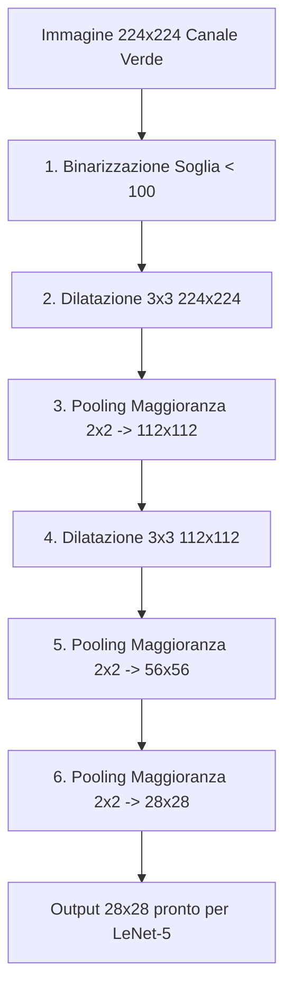

# Progetto Embedded Systems - Riconoscimento Numeri con Scheda ECP5 Lattice (HLS + FPGA Integration)

Questo repository contiene il progetto completo per un sistema embedded di riconoscimento di cifre scritte a mano (dataset MNIST) sviluppato su una scheda FPGA **Lattice ECP5**. Il sistema acquisisce immagini in tempo reale tramite una telecamera collegata via Crosslink (interfaccia RAW10), esegue un pre-processing hardware ottimizzato per ridurre l'immagine a $28 \times 28$ pixel binarizzati e invia l'immagine elaborata a un acceleratore per la rete neurale LeNet-5.

---

## 📂 Struttura del Progetto

Il progetto è suddiviso in tre macro-aree principali che coprono l'intero flusso di sviluppo (dal modello ML al silicio):

### 1. 🧠 Modelli e Prototipi Software (`model_and_prototypes/`)
Contiene lo stack software per l'addestramento della rete neurale, la definizione degli algoritmi di pre-processing e la loro prototipazione in C++:
*   [lenet5_NN.ipynb](file:///Users/giuseppedambrosi/GitHub/Embedded-System---Number-Recogniser-with-Lattice-Board/model_and_prototypes/lenet5_NN.ipynb): Addestramento della rete neurale **LeNet-5** su dataset MNIST con Keras/TensorFlow. Salva il modello finale in formato [lenet_mnist_model.h5](file:///Users/giuseppedambrosi/GitHub/Embedded-System---Number-Recogniser-with-Lattice-Board/model_and_prototypes/lenet_mnist_model.h5).
*   [reduction_&_inversion.ipynb](file:///Users/giuseppedambrosi/GitHub/Embedded-System---Number-Recogniser-with-Lattice-Board/model_and_prototypes/reduction_&_inversion.ipynb): Notebook per lo studio e la validazione visiva degli stadi di pre-processing (binarizzazione, dilatazione morfologica, pooling a maggioranza).
*   [preprocessing_hw.cpp](file:///Users/giuseppedambrosi/GitHub/Embedded-System---Number-Recogniser-with-Lattice-Board/model_and_prototypes/preprocessing_hw.cpp): Prototipo C++ dell'acceleratore di pre-processing, scritto per essere compatibile con i vincoli del compilatore High-Level Synthesis (HLS) Bambu.
*   [hls4ml_for_c.ipynb](file:///Users/giuseppedambrosi/GitHub/Embedded-System---Number-Recogniser-with-Lattice-Board/model_and_prototypes/hls4ml_for_c.ipynb): Esportazione della rete neurale LeNet-5 da Keras a codice sorgente C++ compatibile con HLS tramite la libreria **hls4ml**.

### 🛠️ 2. High-Level Synthesis & Fixes (`Bambu_output/`)
Contiene script e configurazioni per la compilazione della rete neurale e del pre-processing tramite **Bambu HLS**:
*   [readme.txt](file:///Users/giuseppedambrosi/GitHub/Embedded-System---Number-Recogniser-with-Lattice-Board/Bambu_output/readme.txt): Comando esatto per invocare l'immagine AppImage di Bambu, specificando frequenza di clock (25 MHz), interfacce generate ed esecuzione di simulazioni.
*   [fix_all.sh](file:///Users/giuseppedambrosi/GitHub/Embedded-System---Number-Recogniser-with-Lattice-Board/Bambu_output/fix_all.sh): Script bash fondamentale che applica patch automatiche al codice C++ generato da `hls4ml` per risolvere incompatibilità con Bambu e ottimizzare l'uso delle risorse hardware (es. disabilitazione dell'unroll/pipeline eccessivo per evitare l'esaurimento della memoria BRAM/EBR dell'FPGA ECP5).
*   `12_5.zip`: Archivio contenente i report di sintesi intermedi e i file di simulazione.

### 🔌 3. Integrazione FPGA Hardware (`fpga_hardware/`)
Contiene il progetto Lattice Diamond per la sintesi finale e la programmazione della scheda:
*   [Raw10toParallel.ldf](file:///Users/giuseppedambrosi/GitHub/Embedded-System---Number-Recogniser-with-Lattice-Board/fpga_hardware/ECP5_Raw10toParallel/Raw10toParallel.ldf): File di progetto per Lattice Diamond.
*   [RAW10toParallel.v](file:///Users/giuseppedambrosi/GitHub/Embedded-System---Number-Recogniser-with-Lattice-Board/fpga_hardware/ECP5_Raw10toParallel/source/RAW10toParallel.v): File top-level in Verilog. Gestisce il flusso video RAW10 della telecamera, ne estrae il canale verde, pilota l'acceleratore di pre-processing e pilota il display buffer HDMI.
*   [hardware_preprocessing.v](file:///Users/giuseppedambrosi/GitHub/Embedded-System---Number-Recogniser-with-Lattice-Board/fpga_hardware/ECP5_Raw10toParallel/source/hardware_preprocessing.v): Modulo Verilog del pre-processing. È stato ottimizzato a mano con architettura a **Line Buffer (Shift Registers)** eliminando divisioni e moduli hardware, consentendo l'elaborazione streaming real-time a 1 pixel/clock con minimo utilizzo di EBR.

---

## ⚙️ Dettaglio del Pipeline di Pre-Processing

Per poter dare in pasto alla rete neurale (addestrata su MNIST $28 \times 28$ binarizzato) le immagini della telecamera ($224 \times 224$ a colori), il pre-processing segue questa sequenza hardware:



1.  **Binarizzazione**: Il pixel del canale verde viene confrontato con una soglia (`THRESHOLD = 100`). Se è minore di 100 (tratto scuro della penna), viene convertito in `1` (inchiostro). Altrimenti diventa `0` (sfondo bianco).
2.  **Dilatazione Morfologica 3x3 (Stadio 1 & 2)**: Allarga i tratti binarizzati per evitare che il successivo downsampling rompa le linee sottili dei numeri scriti a mano. In hardware è implementato come un OR logico a 9 ingressi alimentato da Line Buffers.
3.  **Pooling a Maggioranza 2x2 (Stadi 1, 2, 3)**: Dimezza le dimensioni spaziali dell'immagine. Invece di un semplice pooling, viene applicato un voto a maggioranza (il pixel risultante è `1` se almeno 2 pixel del blocco $2 \times 2$ sono `1`).
4.  *Nota*: Al terzo stadio ($56 \times 56 \to 28 \times 28$) la dilatazione viene saltata per evitare di fondere fori interni adiacenti (es. all'interno di uno zero o di un otto).

---

## 🖥️ Integrazione nel Flusso Video & HDMI

All'interno del modulo [RAW10toParallel.v](file:///Users/giuseppedambrosi/GitHub/Embedded-System---Number-Recogniser-with-Lattice-Board/fpga_hardware/ECP5_Raw10toParallel/source/RAW10toParallel.v), i pixel $28 \times 28$ generati dall'acceleratore vengono salvati sequenzialmente in un registro di visualizzazione da 784 bit (`display_buf`).

Il sistema include un **MUX di output video** gestibile a compile-time:
*   `localparam MUX_SEL_PREPROCESSING = 1'b1;`: Mostra l'immagine binaria $28 \times 28$ ingrandita di **8 volte** ($224 \times 224$ pixel) all'interno di un'area dedicata sullo schermo HDMI. Questo permette un feedback visivo immediato di come l'FPGA vede ed elabora il numero.
*   `localparam MUX_SEL_PREPROCESSING = 1'b0;`: Flusso video ISP originale senza sovraimpressioni (passthrough standard).

---

## 🚀 Come Riprodurre la Sintesi su Lattice Diamond

1.  Assicurarsi di avere installato **Lattice Diamond** (versione 3.12 o successiva) comprensivo di licenza per ECP5.
2.  Aprire il software Lattice Diamond e caricare il file di progetto:
    `fpga_hardware/ECP5_Raw10toParallel/Raw10toParallel.ldf`
3.  Nella scheda **Process**, fare doppio clic su **Synthesize Design** (Synplify Pro) per compilare l'hardware.
4.  Eseguire **Map Design**, **Place & Route Design** ed infine **Export Files** per generare il file `.bit` per programmare la scheda FPGA tramite il Programmer di Lattice.

---

## 🐍 Come rieseguire la generazione HLS (Bambu)

Se si desidera rigenerare l'acceleratore HLS partendo dal codice C++:
1.  Aprire ed eseguire i notebook nella cartella `model_and_prototypes/` in sequenza.
2.  Dalla cartella principale del progetto, eseguire lo script di patch dei sorgenti C++:
    ```bash
    chmod +x Bambu_output/fix_all.sh
    ./Bambu_output/fix_all.sh
    ```
3.  Lanciare Bambu HLS con i parametri definiti in `Bambu_output/readme.txt`:
    ```bash
    ~/bambu.ginevra2.AppImage --top-fname=myproject -I firmware/ac_types --generate-interface=INFER --clock-period=40 --bambu-parameter=inline-max-cost=0 --simulate --generate-tb=myproject_test.cpp --verbosity=4 firmware/myproject.cpp
    ```
