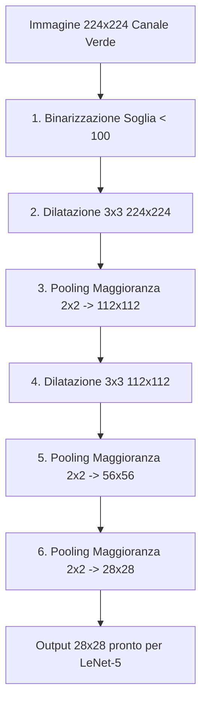

# Progetto Embedded Systems - Riconoscimento Numeri con Scheda ECP5 Lattice (HLS + FPGA Integration)

Questo repository contiene il progetto completo per un sistema embedded di riconoscimento di cifre scritte a mano (dataset MNIST) sviluppato su una scheda FPGA **Lattice ECP5**. 
Il sistema acquisisce immagini in tempo reale tramite una telecamera collegata via Crosslink (interfaccia RAW10), esegue un pre-processing hardware ottimizzato per ridurre l'immagine a $28 \times 28$ pixel binarizzati e invia l'immagine elaborata a un acceleratore per la rete neurale LeNet-5.

---

## 📂 Struttura del Progetto

Il progetto copre l'intero flusso di sviluppo (dal modello ML al silicio) ed è suddiviso nelle tre aree seguenti:

### 1. 🧠 Modelli e Prototipi Software ([model_and_prototypes/](model_and_prototypes/))
Contiene lo stack software per l'addestramento della rete neurale, la definizione degli algoritmi di pre-processing e la loro validazione in Python/C++:
*   [lenet5_NN.ipynb](model_and_prototypes/lenet5_NN.ipynb): Notebook Jupyter per l'addestramento della rete neurale **LeNet-5** su dataset MNIST con Keras/TensorFlow. Salva il modello finale in formato [lenet_mnist_model.h5](model_and_prototypes/lenet_mnist_model.h5).
*   [reduction_&_inversion.ipynb](model_and_prototypes/reduction_&_inversion.ipynb): Notebook per lo studio e la validazione visiva degli stadi di pre-processing (binarizzazione, dilatazione morfologica, pooling a maggioranza).
*   [preprocessing_hw.cpp](model_and_prototypes/preprocessing_hw.cpp): Prototipo C++ dell'acceleratore di pre-processing, scritto per essere compatibile con i vincoli del compilatore High-Level Synthesis (HLS) Bambu.
*   [hls4ml_for_c.ipynb](model_and_prototypes/hls4ml_for_c.ipynb): Esportazione della rete neurale LeNet-5 da Keras a codice sorgente C++ compatibile con HLS tramite la libreria **hls4ml**.

### 🛠️ 2. High-Level Synthesis & Fixes ([Bambu_output/](Bambu_output/))
Contiene configurazioni, script ed elaborati per la compilazione della rete neurale tramite **Bambu HLS**:
*   [readme.txt](Bambu_output/readme.txt): Comando esatto per invocare l'immagine AppImage di Bambu, specificando frequenza di clock (25 MHz), interfacce generate ed esecuzione di simulazioni.
*   [fix_all.sh](Bambu_output/fix_all.sh): Script bash fondamentale che applica patch automatiche al codice C++ generato da `hls4ml` per risolvere incompatibilità con Bambu e ottimizzare l'uso delle risorse hardware (es. disabilitazione dell'unroll/pipeline eccessivo per evitare l'esaurimento della memoria BRAM/EBR dell'FPGA ECP5).
*   [12_5.zip](Bambu_output/12_5.zip): Archivio contenente i report di sintesi intermedi e i file di simulazione.

### 🔌 3. Integrazione FPGA Hardware ([fpga_hardware/](fpga_hardware/))
Contiene il progetto Lattice Diamond per la sintesi finale e la programmazione della scheda:
*   [Raw10toParallel.ldf](fpga_hardware/ECP5_Raw10toParallel/Raw10toParallel.ldf): File di progetto per Lattice Diamond.
*   [Raw10toParallel.lpf](fpga_hardware/ECP5_Raw10toParallel/Raw10toParallel.lpf): File delle specifiche dei vincoli fisici (pinout e timing) per la scheda Lattice.
*   **Pipeline ISP (Image Signal Processor)**:
    *   [RAW10toParallel.v](fpga_hardware/ECP5_Raw10toParallel/source/RAW10toParallel.v): File top-level in Verilog. Riceve il flusso RAW10, sincronizza i pixel, pilota la telecamera via I2C, invia il canale verde all'acceleratore di pre-processing e gestisce il mux di visualizzazione HDMI.
    *   [debayer.v](fpga_hardware/ECP5_Raw10toParallel/source/debayer.v): Interpolazione cromatica da Bayer Pattern RAW10 a canali RGB paralleli.
    *   [gamma_correction.v](fpga_hardware/ECP5_Raw10toParallel/source/gamma_correction.v): Correzione gamma tramite LUT hardware.
    *   [color.v](fpga_hardware/ECP5_Raw10toParallel/source/color.v): Gestione dello spazio colore.
    *   [blanking_adjustment.v](fpga_hardware/ECP5_Raw10toParallel/source/blanking_adjustment.v): Modifica dei timing video e delle aree di blanking per la stabilità del display.
    *   [image_pipe.v](fpga_hardware/ECP5_Raw10toParallel/source/image_pipe.v): Modulo che incapsula debayering, correzione gamma, CSC e FIFO FIFO.
    *   [i2c_top.v](fpga_hardware/ECP5_Raw10toParallel/source/i2c_top.v) (e relativi `i2c_ctrl.v`, `i2c_core.v`): Controller per l'inizializzazione del sensore della telecamera.
    *   [hdmi_i2c_top.v](fpga_hardware/ECP5_Raw10toParallel/source/hdmi_i2c_top.v) (e relativi `hdmi_i2c_ctrl.v`, `hdmi_i2c_core.v`): Controller per l'inizializzazione del chip trasmettitore HDMI SiI1136.
*   **Acceleratore di Pre-processing**:
    *   [hardware_preprocessing.v](fpga_hardware/ECP5_Raw10toParallel/source/hardware_preprocessing.v): Modulo di pre-processing ottimizzato a mano con architettura streaming **Line Buffers (Shift Registers)** e macchina a stati finiti (FSM).

---

## ⚙️ Dettaglio del Pipeline di Pre-Processing

Per poter dare in pasto alla rete neurale (addestrata su MNIST $28 \times 28$ binarizzato) le immagini della telecamera ($224 \times 224$ a colori), il pre-processing esegue la seguente sequenza:

1.  **Binarizzazione**: Il pixel del canale verde viene confrontato con una soglia (`THRESHOLD = 100`). Se è minore di 100 (inchiostro scuro), diventa `1` (attivo). Altrimenti diventa `0` (sfondo bianco).
2.  **Dilatazione Morfologica 3x3 (Stadi 1 & 2)**: Allarga i tratti binarizzati per preservare le linee sottili dei numeri scritti a mano prima del downsampling.
3.  **Pooling a Maggioranza 2x2 (Stadi 1, 2, 3)**: Riduce a metà le dimensioni spaziali dell'immagine. Il pixel risultante è `1` se almeno 2 pixel del blocco $2 \times 2$ sono `1` (voto a maggioranza per evitare di perdere la traccia).
4.  *Nota*: Al terzo stadio ($56 \times 56 \to 28 \times 28$) la dilatazione viene omessa per evitare la fusione di fori o tratti adiacenti (es. per cifre come lo 0, l'8 o il 9).

---

## 🏗️ Architettura Hardware del Pre-processing

Il modulo [hardware_preprocessing.v](fpga_hardware/ECP5_Raw10toParallel/source/hardware_preprocessing.v) è implementato come una macchina a stati finiti (FSM) sequenziale ultra-efficiente. 

### Caratteristiche principali:
*   **Zero Divisioni/Moduli**: Sostituiti tutti i divisori hardware con contatori ed incrementi coordinati per determinare coordinate X e Y locali a costo logico nullo.
*   **Line Buffers (Shift Registers)**: Finestre 3x3 (per dilatazione) e 2x2 (per pooling) implementate tramite shift register di lunghezza pari alla riga dell'immagine. Questo consente di effettuare l'elaborazione dei pixel in streaming (1 pixel per ciclo di clock) effettuando solo **1 lettura e 1 scrittura per ciclo di clock**, ottimizzando l'inferenza di blocchi di memoria a doppia porta (EBR) ed eliminando colli di bottiglia causati da porte di lettura multiple.
*   **Macchina a Stati (FSM)**:
    *   `S_IDLE`: In attesa del fronte di inizio frame.
    *   `S_LOAD`: Riceve e binarizza i pixel del frame a 224x224 (salvato in `buf_bin`).
    *   `S_DIL1`: Esegue la prima dilatazione 3x3 tramite `lb_dil1` (salvato in `buf_dil1`).
    *   `S_POOL1`: Esegue il pooling 2x2 a maggioranza tramite `lb_pool1` (salvato in `buf_pool1` a 112x112).
    *   `S_DIL2`: Esegue la seconda dilatazione 3x3 tramite `lb_dil2` (salvato in `buf_dil2`).
    *   `S_POOL2`: Esegue il secondo pooling 2x2 tramite `lb_pool2` (salvato in `buf_pool2` a 56x56).
    *   `S_POOL3`: Esegue il terzo pooling 2x2 senza dilatazione tramite `lb_pool3` (salvato in `buf_out` a 28x28).
    *   `S_OUTPUT`: Trasmette sequenzialmente il frame binarizzato finale da 784 pixel con validatore `o_valid` attivo.

---

## 🛠️ Modifiche e Patch per Bambu HLS (`fix_all.sh`)

La compilazione HLS di reti neurali generate con `hls4ml` può portare a problemi di incompatibilità di tipi o esaurimento di risorse sull'FPGA ECP5. Lo script [fix_all.sh](Bambu_output/fix_all.sh) risolve automaticamente questi problemi prima del caricamento in Bambu:

1.  **Correzione dei Tipi C++**: Sostituisce stringhe errate come `usnigned` in `unsigned` all'interno delle librerie di tipi arbitrari (`ac_int.h`). Risolve inoltre definizioni `decltype` ambigue nei moltiplicatori fixed-point (`nnet_mult.h`).
2.  **Disabilitazione di Pipelining e Unrolling Eccessivo**: Rimuove i pragma `#pragma HLS unroll` e `#pragma HLS pipeline` da `nnet_conv2d.h`. Senza questa patch, Bambu cercherebbe di srotolare completamente i loop convoluzionali, esaurendo le risorse logiche e di memoria EBR/BRAM del chip Lattice ECP5.
3.  **Rimozione di Istruzioni non Sintetizzabili**: Elimina l'istruzione `#pragma HLS interface mode=valid` e le stampe diagnostiche `std::cout` in `nnet_helpers.h`.
4.  **Eliminazione di Partitioning Rigido**: Rimuove i pragma `#pragma HLS ARRAY_PARTITION` per prevenire il consumo eccessivo di registri a favore di memorie locali strutturate in EBR.

Il comando utilizzato per invocare la sintesi Bambu sul modello modificato è riportato in [readme.txt](Bambu_output/readme.txt).

---

## 🖥️ Integrazione nel Flusso Video & HDMI

All'interno del modulo [RAW10toParallel.v](fpga_hardware/ECP5_Raw10toParallel/source/RAW10toParallel.v), il frame a $28 \times 28$ binarizzato viene memorizzato in un registro di visualizzazione da 784 bit (`display_buf`).

Per consentire un feedback visivo immediato delle operazioni di elaborazione, il sistema include un **multiplexer di visualizzazione video** configurabile staticamente a compile-time:
*   `localparam MUX_SEL_PREPROCESSING = 1'b1;`: Mostra l'immagine binaria $28 \times 28$ **ingrandita di 8 volte** (quindi $224 \times 224$ pixel) all'interno dell'area in alto a sinistra dello schermo HDMI, sovrapposta al flusso video originale.
*   `localparam MUX_SEL_PREPROCESSING = 1'b0;`: Flusso video originale diretto della telecamera (modalità passthrough standard senza sovrimpressioni).

La lettura a risoluzione aumentata viene calcolata combinatoriamente mappando i pixel della griglia attiva $224 \times 224$ HDMI sull'indirizzo corrispondente del buffer da 784 bit tramite:
$$\text{colonna} = \lfloor hcnt / 8 \rfloor, \quad \text{riga} = \lfloor vcnt / 8 \rfloor$$
$$\text{indirizzo} = \text{riga} \times 28 + \text{colonna}$$

---

## 🚀 Come Riprodurre la Sintesi su Lattice Diamond

1.  Assicurarsi di avere installato **Lattice Diamond** (versione 3.12 o successiva) comprensivo di licenza attiva per dispositivi ECP5.
2.  Aprire Lattice Diamond e caricare il file di progetto:
    `fpga_hardware/ECP5_Raw10toParallel/Raw10toParallel.ldf`
3.  Nel pannello **Process**, fare doppio clic su **Synthesize Design** (utilizzando Synplify Pro) per compilare l'hardware.
4.  Eseguire **Map Design**, **Place & Route Design** e infine fare doppio clic su **Export Files** per generare il file bitstream `.bit`.
5.  Programmare l'FPGA Lattice ECP5 tramite il tool **Programmer** di Lattice Diamond.
